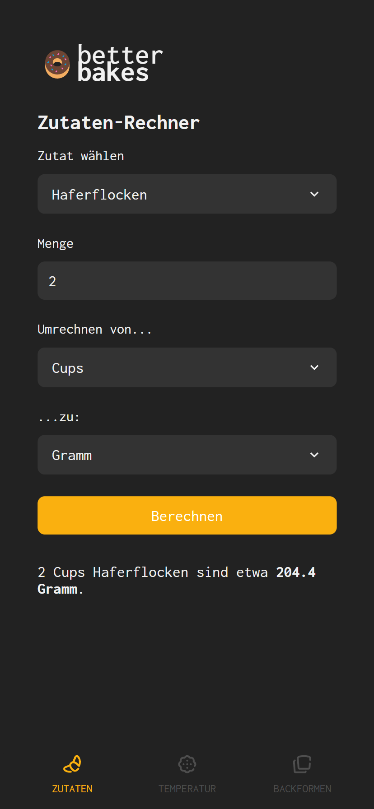
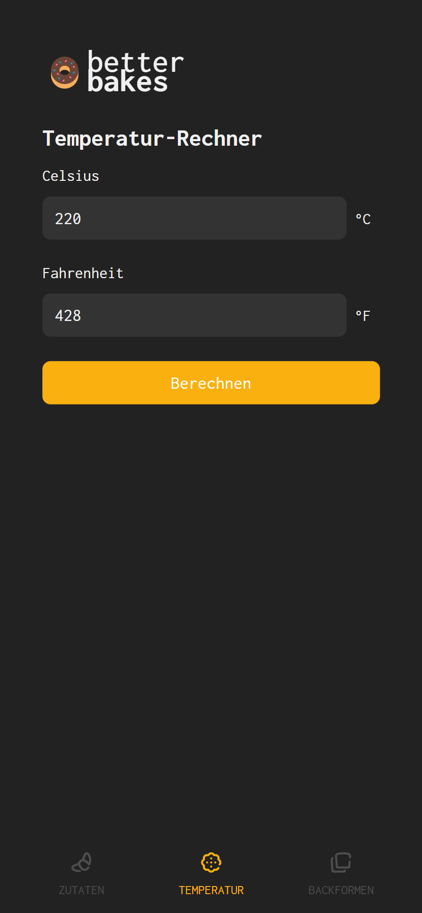
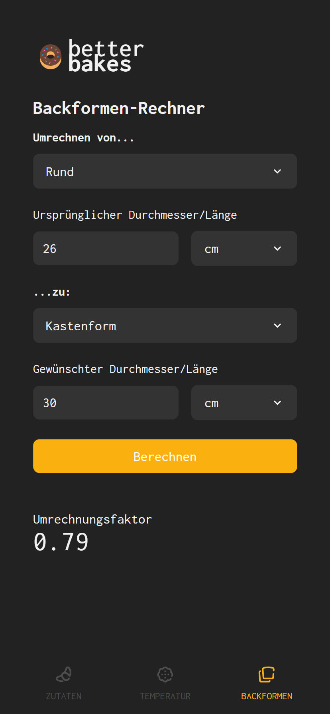

# better bakes

Better Bakes is a kitchen unit converter for metric to volume conversion, temperature conversion and pan size conversion. It is written in Vue 3 and Typescript with German localization and CapacitorJS for an installable Android version.

<p>
  
  
    
</p>

## Check it out

The web app is currently deployed on Netlify and can be accessed from this link:

[Better Bakes on Netlify](https://better-bakes.netlify.app/)

## Add new values

You're welcome to open a PR to expand the current ingredient database. As this app has no backend, no sensitive data and is read-only, the data lives directly in the frontend.

### Ingredients and units

1. Define universal ingredient name as well as density (grams per cm<sup>3</sup>) and add to the list in stores/ingredients.ts. Supply default conversion units (from/to).

```
{
  name: 'butter',
  gramsPerCm3: 0.959
}
```

2. Add translations in de.json and en.json, referencing the previously given name.

The same process applies to units. Here, it is also necessary to specify whether the unit is volume-based or weight-based. Then, you need to calculate the base unit factor, specifying how the unit translates to either grams (if unit is weight-based) or cm<sup>3</sup> (if unit is volume-based).

### Ingredient Replacements

1. Specify replacement by adding the names of both the ingredient that should be replaced and the replacement ingredient to the list in stores/replacements.ts.

2. Check if both ingredients are in the translations file. If not, add them. Also, if possible, add them to the ingredients list.

3. To supply a substitution guide (e.g. how much or any limitations), create a translation under repl > guides with the name of the ingredient that is to be replaced.

Currently, substitutions are limited to one ingredient and are one-way only.


